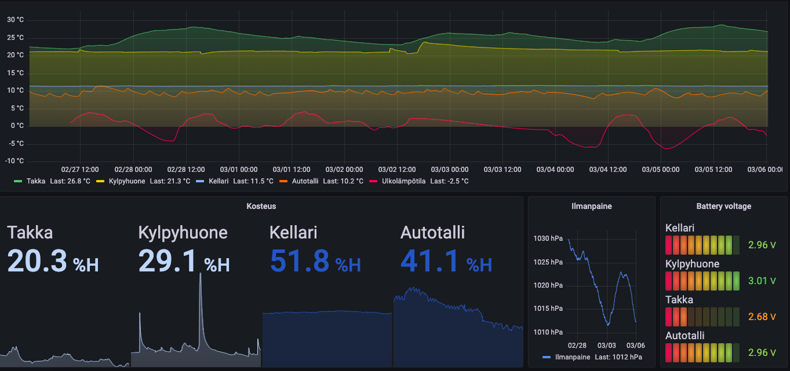

# raspberrypi-ruuvi-gateway
This project uses Raspberry Pi as a gateway to push RuuviTag data to InfluxDB 1.8+ database.

## Prerequisite steps for Raspberry Pi
Setting up the permissions of Bluetooth adapter of Raspberry Pi is as follows
```shell
  sudo apt install bluez bluez-hcidump
  sudo setcap 'cap_net_raw,cap_net_admin+eip' `which hcitool`
  sudo setcap 'cap_net_raw,cap_net_admin+eip' `which hcidump`
```
## Install InfluxDB on Raspberry Pi
```shell
  wget https://dl.influxdata.com/influxdb/releases/influxdb_1.8.10_armhf.deb
  sudo dpkg -i influxdb_1.8.10_armhf.deb
```
Start influx console with influx, and create database for ruuvi measurements with command CREATE DATABASE ruuvi

## Grafana
Grafana is used to create dashboard and run some simple analytics on data. Download latest grafana binaries for Raspberry Pi from Grafana official distribution https://grafana.com/grafana/download?edition=oss. Raspberry Pi 3, 3B+ and 4 use ARMv7.

Enable grafana with
```
sudo systemctl daemon-reload
sudo systemctl enable grafana-server
sudo systemctl start grafana-server
sudo systemctl status grafana-server
```
If everything has been properly set up, we can now browse over to raspberrypi.local:3000 and see web-ui of grafana. Default user and password is admin/admin.
### Example dashboard using Grafana


## Create systemd service for running the influx_hanlder.py

```
sudo nano /etc/systemd/system/ruuvi.service
```

```
[Unit]
Description=Ruuvitag service
After=network.target

[Service]
Type=simple
WorkingDirectory=/home/pi/ruuvitag
ExecStart=/usr/bin/python3 /home/pi/ruuvitag/ruuvi_handler.py
User=pi

[Install]
WantedBy=multi-user.target
```

## Create systemd service and timer for weather API handler
### Weather service
```
sudo nano /etc/systemd/system/weather.service
```

```
[Unit]
Description=Weather api service
After=network.target

[Service]
Type=simple
WorkingDirectory=/home/pi/ruuvitag
ExecStart=/usr/bin/python3 /home/pi/ruuvitag/weather_handler.py
User=pi

[Install]
WantedBy=multi-user.target
```
### Weather service timer
```
sudo nano /etc/systemd/system/weather.timer
```

```
[Unit]
Description=Schedule an API call every hour
Requires=weather.service

[Timer]
#Execute job if it missed a run due to machine being off
Persistent=false
#Run 120 seconds after boot for the first time
OnBootSec=120
#Run every hour thereafter
OnCalendar=*-*-* *:00:00
#File describing job to execute
Unit=weather.service

[Install]
WantedBy=timers.target
```

````
sudo systemctl daemon-reload
sudo systemctl enable ruuvi.service weather.service weather.timer
sudo systemctl start ruuvi.service weather.timer
````
